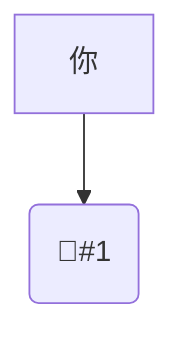
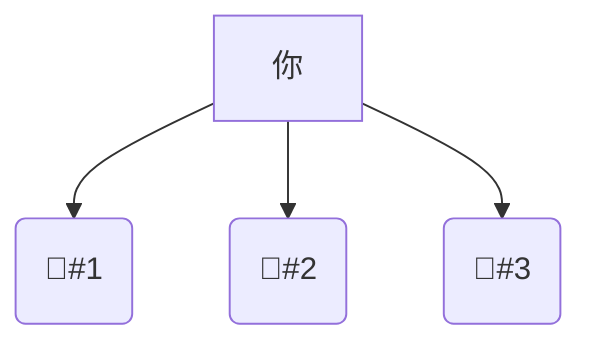
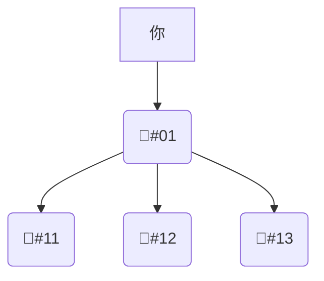

# 那只🦞

AI 的发展想必不用多说，速度之快远超我们的想象。将 AI 大事记和标普 500 [^ai-events-vs-sp500] 整合绘制折线图如下：



[^ai-events-vs-sp500]: 数据来源：<https://sc.macromicro.me/time_line?id=26&stat=2>

从图中可以看出，自 2015 年 OpenAI 成立以来，随着标普 500 指数的不断增高，AI 也在以倍速迅猛发展。毋庸置疑在这个时代，如果你不了解 AI，不紧跟 AI，那么你可能会很快就会被社会淘汰。随着一股“龙虾热”的到来，更是把 AI 的关注度推到了风口浪尖。积极的去拥抱新的技术，亲自下场去体验，这都是很好的事，但也大可不必因为 FOMO（Fear of Missing Out，错失恐惧症）而太过盲从。即使你全身心 100% 的投入，在 AI 的浪潮中依然会有你错失的，停下来根据自身的实际情况多一些思考，才是争取不被拍死在沙滩上的最好选择。Anyway，一人开发者的周末项目，在短短不到 5 个月的时间内登顶 GitHub，这里面所预示的变革也绝不是我这些许思考所能妄言定论的，让我们且行且悟吧。

前不久在组织内部（大部分成员并非技术背景）讨论 AI 应用的时候（彼时公司已经提供了内部免费版的龙虾供大家试用），我抛出了如下两个问题：

1. 有多少人尝试过私有化部署龙虾？
2. 如果由你自己承担龙虾的费用，你是否还会像当前这样使用龙虾？

第一个问题要从前不久如火如荼的排队装龙虾开始说起，从安装龙虾，再到卸载龙虾，每个时代都有每个时代的鸡蛋要领。晚点有篇文章 [^latepost] 不错，提到网上流传着的一个悖论：“如果你需要托人帮你安装龙虾，那么你可能就不太需要龙虾。”这句话多少有些偏激了，但意思就是那么个意思，如果连这部分技术都不了解，那么在使用龙虾的过程中一旦遇到一些复杂情况，你就会陷入“问虾你为什么不行”-“虾说因为 XXX”-“你说你自己不能解决码？”-“虾说 balabalabalabala”的死循环当中。或者换个角度，如果龙虾真的无论是从可用还是易用角度做到了极致，那么此时此刻是否还需要你这个人去用它呢？这时最重要的问题或许是我们这些碳基生物应该如何避免被硅基生物消灭吧？

第二个问题会比较实在些，天天在谈 ROI，公司出于更长远的战略考虑给到一定的免费额度，但如果需要实打实的花自己钱的时候你真的还会随便用吗？只能说当下很多人还没有被 AI 替代是因为 AI 的成本比我们这些牛马的工资还是要高的。我相信随着技术的不断发展，AI 的成本也会越来越低，此时我们更需要思考些更适合 AI 去做，哪些更适合我们去做，那些 AI 暂时还替代不了我们去做的才是我们的核心竞争力，再用 AI 把自己加持下才是最妙的。

[^latepost]: <https://www.latepost.com/news/dj_detail?id=3463>

# 生产力

{}
生产力是改造和影响自然并使之适应社会需要的客观物质力量。一定的生产力决定了一定的生产关系，二者组成特定的生产方式。
{}

AI 是一种先进的生产力，这个应该不太会有人否认吧。我个人总结其主要先进在两个方面：

1. 效率。AI 在效率提升上面的效果是有目共睹的，无论你的工作类型是什么样的，哪怕你是体力劳动者。只能说对脑力工作者的提效会更多些，尤其是那些流程化、重复性的工作，以运营类工作尤为明显。对我而言更好的代码补全也着实提高了我的开发效率。
2. 创新。对于一些复杂的不确定性工作，AI 可以给到我很多新奇的点子，启发我把复杂的任务成功解决。很难说这是真的“创新”，也许在 AI 的脑子中这并非新鲜事物，但之于我自己而言，确实给到我眼前一亮的惊喜。前不久 Anthropic 团队使用 16 个智能体从零开始构建了一个基于 Rust 的 C 语言编译器 [^anthropic]。我很惊讶这么底层的能力就这样被自动实现了（我并没有去体验，单纯的惊讶），但也有人质疑这只是“临摹”而非“创作”。毕竟 AI 吃过的盐比我吃过的饭都要多得多得多。因此无须太纠结这是不是真的创新，之于你是，之于你在做的事儿是，那就是。

在谈及 AI 作为一种先进的生产力时，它与瓦特的蒸汽机、爱迪生的电灯泡、亦或是宾夕法尼亚大学的埃尼阿克并无差异，本质上都是社会生产环节中的一个辅助工具。

[^anthropic]: <https://www.anthropic.com/engineering/building-c-compiler>

# 生产关系

{}
生产关系是人们在社会生产中形成的一种一定的、必然的、不以他们的意志为转移的关系。生产关系基于一定生产力，反过来又会限制生产力。
{}

根据定义来看，AI 确实“不是”生产关系，生产关系探讨的主要是“人”与“物”以及“人”与“人”的关系，例如：生产资料所有制，生产中的地位和相互关系，产品的分配方式等。但 AI 作为生产力却可以影响生产关系，我认为此时用“重塑”会更适合些，因为这波 AI 带来的冲击确实过于迅猛。

之前听过付鹏的几期演讲和相关的播客，他将套利 [^arbitrage] 的核心归纳为价差、利差、汇差，而在这些之前，还会有信息差、认知差、执行差、竞争差、资源差等等。我个人不是很懂投资，买过的股票基金啥的大多也是赔的，听的这些投资内容更多是出于对经济和风险的进一步理解。AI 在帮助我们缩小信息差、认知差、执行差、竞争差、资源差这些方面比之前变得更有可能，尤其是对于我们这些屁民而言。试想一下，之前在一个未知领域遇到了一个问题，Google 一下，搜索引擎玩儿的溜的能多获取一些有用的信息，玩儿不转的就只能凭人品看看有没有靠谱的朋友帮你解惑一二了。如果你有钱那就另说了，此时你又营造了资源差，但 AI 在帮助大家提升认知上貌似是公平的，是容易的。那么当答案获取变得便宜之后，什么又变得昂贵了呢？勇气，执行力，还是？

[^arbitrage]: <https://zh.wikipedia.org/zh-cn/套利>

前不久比较火的一个词应该是“一人公司”（OPC，One Person Company），一个由 AI 技术驱动产生的全新组织范式。如果把一人公司做到极致，貌似你只需要同你的 AI 进行直接交流，AI 可以帮你去对接客户，AI 可以帮你去做产品，AI 可以帮你去销售。此时“人”-“人”的关系就转变成了“人”-“AI”-“人”的关系，甚至是“人”-“AI”-“AI”-“人”的关系，谁知道你的 AI 对接的客户是不是也是一个 AI 呢？从内部视角来看也是一样，从养一只虾到养多只虾，从管多只虾到管一只管多只虾的虾。



{}

{}

{}

{}

{}

{}



你时不时的 PUA 下你的虾，你的虾时不时的摸会儿鱼。作为基层管理者的监管虾忙着分配任务和验收结果，而作为大头兵的牛马虾快乐小狗般地研究是巧克力味儿的屎好还是屎味儿的巧克力好，最后把监管虾看得着急的不要不要的，还不敢和你真实汇报。等你下场去检查的时候，屎山已经高的望不到顶了。这不就是一个活脱脱的赛博职场吗？此时我只想说对你的虾好一点儿，交代任务时加个“请”字，可能比你说他笨更有用些，真的。

旧世界的神（各种差）力量正在减弱，新世界的神（AI）已然崛起 [^american-gods]。生产力的跃升总是先行的，随后才是生产关系的重构，当生产力的“安装期”接近尾声时, 生产关系的变革将成为主线 [^zhihu-answer-1987132406327697950]，此时你的信仰又该何去何从？

[^american-gods]: 此处有梗，点明一下，来自美国众神：<https://zh.wikipedia.org/zh-cn/美国众神>

[^zhihu-answer-1987132406327697950]: <https://www.zhihu.com/question/592500469/answer/1987132406327697950>

# 技术平权

最后我想再谈一点儿技术平权，感觉“龙虾热”把技术平权又双叒叕一次拿到了台面上。有两个问题，我的观点分别如下：

1. 技术平权好吗？我认为技术平权整体来看是**好的**，如果技术平权存在的话。技术平权可以让更先进的技术平等的惠及每一个人，整体上会极大的提高生产力。但这也会引发一定的焦虑，当技术稀缺时，焦虑只发生在少数人之间，当它开始民主化后，焦虑会迅速扩散，这在组织推进 AI 落地时需要格外关注。
2. 技术平权存在吗？我认为技术平权**不存在**。上个世纪还在用打孔卡进行编程，高性能计算机的普及依旧没有让编程变成普惠技术。也许你会说技术进步的还不够，看看现在的 Vibe Coding，那我会说 Vibe Coding 真的不错，你真的用了吗？你用它写出来的东西应用在生产环境了吗？厉害的人在 Vibe Coding 中更上层楼，不行的人只是换了一种方式堆屎山。

在这里我并没有为我们这些所谓的“工程师”粉饰门面，也没有打消大家探索新世界积极性的意思。想表达的是在科技洪流中，我们更需要思辨，去伪存真，鸿沟永远存在，找到一条更好提升自己的路，平权不平权不重要，干得过别人才重要。周末读到一篇文章，在此分享出来：[《谁在制造“龙虾热”？当我们穿过一场名为“技术平权”的幻梦》](https://www.jiemian.com/article/14146430.html)，观点因人而异，但希望可以缓解部分人的焦虑。

# 最后的最后

最后的最后，改编一下我比较喜欢的胡适先生的话「大胆假设，小心求证」，AI 时代的我们可以「积极拥抱（这是态度），审慎思考（这是行为）」。AI 作为生产力终究不能自发地改变现有的生产关系，仍需要人的主观能动性。如果未来有一天硅基生命崛起，彼时的人类又是否会变成如当下的 AI 一样，成为一种“工具”，只不过是一种作为被奴役的稀有的资源般存在的“工具”。我不想这天的到来，至少在我有生之年。
